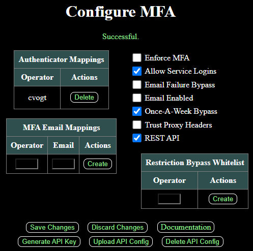

# MFA Add-On

WebCTRL is a trademark of Automated Logic Corporation. Any other trademarks mentioned herein are the property of their respective owners.

## Installation

1. If your server requires signed add-ons, copy the authenticating certificate [*ACES.cer*](https://github.com/automatic-controls/addon-dev-script/blob/main/ACES.cer?raw=true) to the *./programdata/addons* directory of your WebCTRL installation folder.

2. Install [*MFA.addon*](https://github.com/automatic-controls/mfa-addon/releases/latest/download/MFA.addon) using the WebCTRL interface.

## General Information

This add-on provides the ability to use multi-factor authentication when logging into WebCTRL. Third-party libraries [otp-java](https://github.com/BastiaanJansen/otp-java) and [qrcodejs](https://github.com/KeeeX/qrcodejs) are used for TOTP and QR code implementations in order to support authenticator apps. This add-on should function on WebCTRL versions 8.0 and later. It is not compatible with the LDAP or SSO add-ons provided by ALC (or any other add-on which modifies WebCTRL's authentication provider).

If a user's email address is configured to receive MFA codes, then WebCTRL's email server configuration is used to send a random 6-digit code upon login. Security codes expire in 5 minutes, and users get 3 attempts to enter the code correctly. You can also configure an authenticator app (e.g, Google Authenticator). When both an authenticator app and an email address are configured, the authenticator app takes precedence. Security codes are automatically rejected for a user if 5 or more failed verification attempts have occurred in the past 90 seconds. After logging in, an item will show up in the system menu allowing users to configure or change the MFA email address and authenticator associated to their account.

- After installing the add-on, you must logout and login for the *Configure MFA* button to show up in the system menu.

System administrators can change settings in the add-on's main page. MFA emails can be viewed or changed for any user. If a user accidentically configures an incorrect email for MFA, a system administrator can navigate to this page and delete the relevant email mapping. Authenticator app configurations can also be deleted here when necessary.

Users can be added to a restriction bypass whitelist which makes them behave as if MFA is not enforced, service logins are allowed, and MFA bypass on email server failure is enabled. All settings are described in more detail below.

| Setting | Default | Description |
| - | - | - |
| ***Issuer*** | `WebCTRL` | This field will be displayed in your authenticator app after scanning QR codes. It is intended to uniquely identify this server. A length limit of 40 characters is enforced. |
| ***Enforce MFA*** | `false` | When MFA is enforced, all non-whitelisted users will be forced to configure MFA when they login. |
| ***Allow Service Logins*** | `true` | When unchecked, non-whitelisted users with MFA enabled will be unable to login to WebCTRL services such as SOAP and TELNET (these services are incompatible with MFA). |
| ***Bypass MFA on Email Server Failure*** | `true` | When WebCTRL fails to connect to its email server, MFA security codes cannot be sent. This option permits MFA to be bypassed in such a case. Otherwise, non-whitelisted users with MFA enabled will not be able to login. |
| ***Email Enabled*** | `true` | Specifies whether to allow MFA codes sent by email. The preferred method is to use an authenticator app. |
| ***Once-A-Week Bypass*** | `true` | Specifies whether to bypass MFA on subsequent logins from the same IP address and username for one week after the first successful MFA login. |
| ***Trust Proxy Headers*** | `false` | This option is applicable only when ***Once-A-Week Bypass*** is enabled. This specifies whether to trust the `Forwarded`, `X-Forwarded-For`, and `X-Real-IP` headers. This is useful when WebCTRL is behind a reverse proxy. When WebCTRL is not behind a proxy, it is recommended to leave this disabled for security reasons. |
| ***REST API*** | `false` | Specifies whether to enable the public REST API for MFA authentication. |

Consider a scenario where you are managing multiple WebCTRL servers. It is annoying to have a separate MFA code for every server. The REST API option is designed to solve this problem. Enable the REST API on one server, and all other servers can forward MFA requests to it. For security, the REST API should only be enabled for a server which is accessible over HTTPS. Currently, only authenticator apps are supported when using the API.

In such cases, MFA can still be configured individually on each server. MFA requests are only forwarded when there is a matching username on the upstream server that has MFA enabled or enforced. Requests are forwarded on a best-effort basis, which means that MFA will be bypassed if the upstream server cannot be reached in a reasonable amount of time. Therefore, a DDoS attack on the REST API server could allow MFA to be bypassed on all downstream servers.

In my opinion, I would prefer a DDoS attack (or temporary outages, server maintenance, etc.) to result in MFA being bypassed, rather than result in the rejection of all logins everywhere. It has not been my intention to reject legitimate logins when something goes wrong, so I've opted to implement enhanced security with MFA on a best-effort basis instead. If anyone disagrees, I am open to adding a configuration option '***Bypass MFA on Upstream Server Failure***' that is enabled by default, which you can then disable at your leisure. You could also try using ALC's SSO add-on instead and link it to something which already supports MFA.

To configure the REST API, click the **Generate API Key** button, and a `mfa_api.conf` file will be downloaded. The generated key can be used to access the REST API on this server when enabled. `mfa_api.conf` can be uploaded to other WebCTRL servers running the MFA add-on. Then MFA verification requests will be forwarded to the server hosting the REST API.

This use-case of managing multiple WebCTRL servers with the REST API is why the ***Once-A-Week Bypass*** setting records a list of trusted IP addresses for each user as opposed to simply using browser cookies. Browser cookies are tied to specific domains, and a cookie saved for one WebCTRL server in your browser will not necessarily transfer to the other servers.

When your WebCTRL server is behind a reverse proxy, and you have ***Trust Proxy Headers*** enabled, you should ensure that your proxy has precise control over the `Forwarded`, `X-Forwarded-For`, and `X-Real-IP` headers. If your proxy does not manage these headers appropriately, then a malicious entity could spoof these headers and bypass MFA if they know a trusted IP address. In this case, the proxy should erase any client-specified values of these headers and overwrite them with the client's IP address as seen by the proxy. Refer to <https://httptoolkit.com/blog/what-is-x-forwarded-for/> for more information.

Moreover, if your WebCTRL server is behind a proxy, and you do not enable ***Trust Proxy Headers***, then all requests will look like they come from the proxy's IP address. Which means all MFA attempts will be bypassed for a week after the first successful verification. So enabling this option when behind a proxy is better than not doing so, even if you cannot guarantee whether the proxy handles headers appropriately. This is another one of those '*security on a best-effort basis*' scenarios.