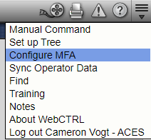
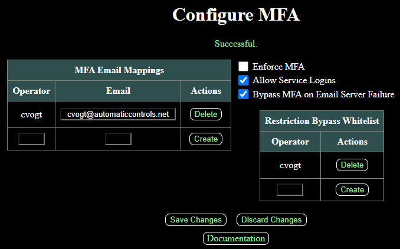

# MFA Add-On

WebCTRL is a trademark of Automated Logic Corporation. Any other trademarks mentioned herein are the property of their respective owners.

## Installation

1. If your server requires signed add-ons, copy the authenticating certificate [*ACES.cer*](https://github.com/automatic-controls/addon-dev-script/blob/main/ACES.cer?raw=true) to the *./addons* directory of your WebCTRL installation folder.

2. Install [*MFA.addon*](https://github.com/automatic-controls/mfa-addon/releases/latest/download/MFA.addon) using the WebCTRL interface.

## General Information

This add-on provides the ability to use multi-factor authentication when logging into WebCTRL. This add-on has been tested on WebCTRL8.5 and WebCTRL9.0. The add-on uses WebCTRL's email server configuration to send a random 6-digit code to a user's email address upon login. Security codes expire in 5 minutes, and users get 3 attempts to enter the code correctly. After logging in, an item will show up in the system menu allowing users to configure or change the MFA email address associated to their account.

- After installing the add-on, you must logout and login for the *Configure MFA* button to show up in the system menu.

System administrators can change settings in the add-on's main page. MFA emails can be viewed or changed for any user. If a user accidentically configures an incorrect email for MFA, a system administrator can navigate to this page and delete the relevant email mapping.

Users can be added to a restriction bypass whitelist which makes them behave as if MFA is not enforced, service logins are allowed, and MFA bypass on email server failure is enabled (described in more detail below).

| Setting | Description |
| - | - |
| ***Enforce MFA*** | When MFA is enforced, all non-whitelisted users will be forced to configure MFA when they login. |
| ***Allow Service Logins*** | When unchecked, non-whitelisted users with MFA enabled will be unable to login to WebCTRL services such as SOAP and TELNET (these services are incompatible with MFA). |
| ***Bypass MFA on Email Server Failure*** | When WebCTRL fails to connect to its email server, MFA security codes cannot be sent. This option permits MFA to be bypassed in such a case. Otherwise, non-whitelisted users with MFA enabled will not be able to login. |

I suggest adding a least one operator to the restriction bypass whitelist, especially if MFA is enforced and bypass MFA on email failure is disabled. Whitelisted operators can still configure and use MFA on their accounts.